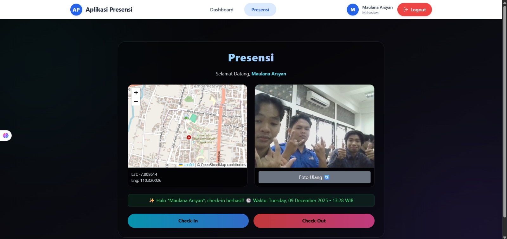
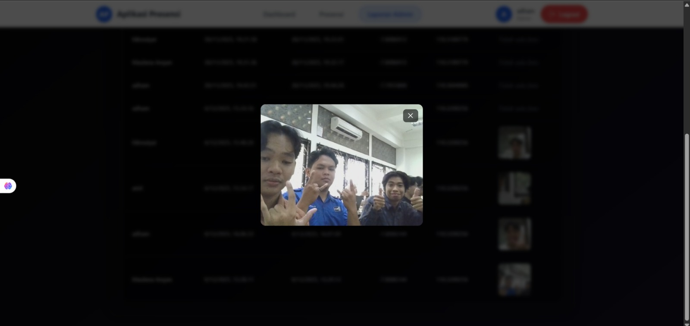
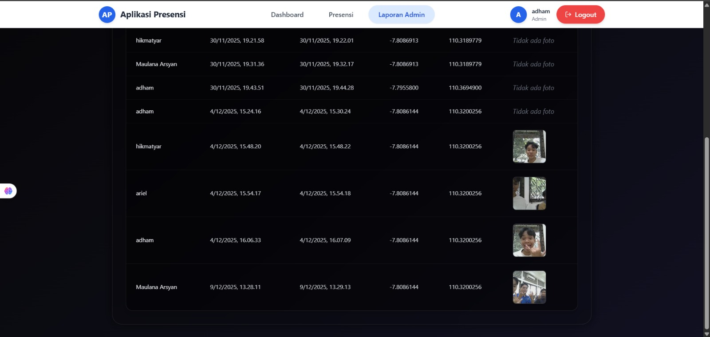
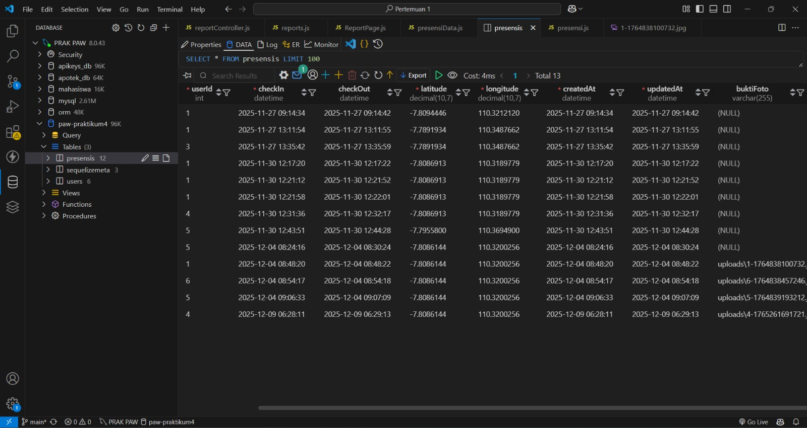

# 🧾 Tugas 10 – Fitur Presensi (Check-In, Popup Foto, Database & Report)

**Nama:** Hikmatyar Alghifary  
**NIM:** 20230140193  
**Mata Kuliah:** Pengembangan Aplikasi Web  

---

# 🖼️ Dokumentasi Tampilan Aplikasi

| No | Nama Halaman        | Screenshot |
|----|---------------------|------------|
| 1  | Halaman Absen (Check-In / Check-Out) |  |
| 2  | Popup Foto (Preview Gambar) |  |
| 3  | Halaman Report Presensi |  |
| 4  | Halaman Database Presensi |  |

---
