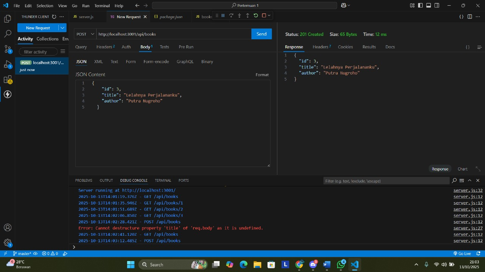
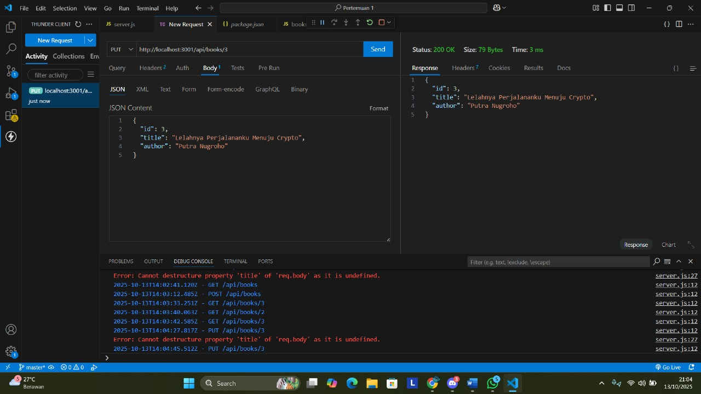
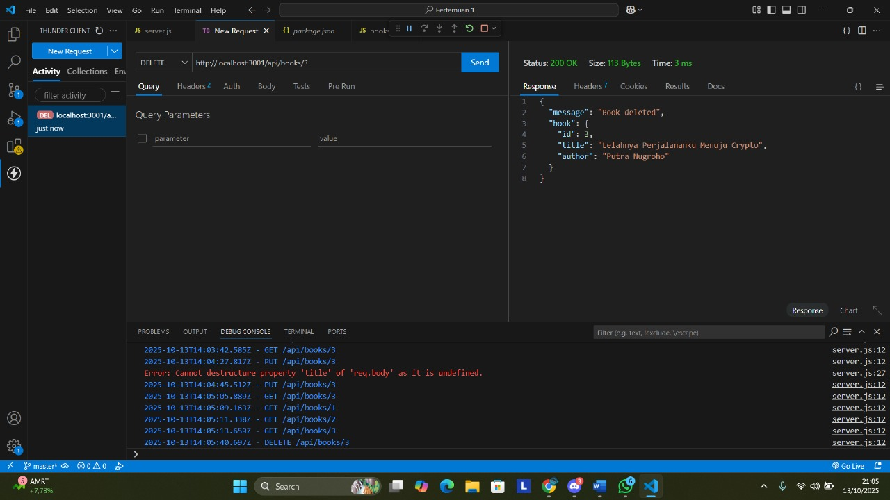

# Tugas 2 - CRUD Buku Perpustakaan

## API Endpoint Screenshots
Berikut hasil uji CRUD menggunakan Thunder:

### 🔹 1. GET Semua Buku (Menampilkan)

---

### 🔹 2. GET Buku Berdasarkan ID (Menampilkan)
#### a. GET ID 1

#### b. GET ID 2

---

### 🔹 3. POST Buku Baru (CREATE)

📄 **Hasil setelah POST (GET ID 3 Setelah POST):**

---

### 🔹 4. PUT Update Buku

📄 **Hasil setelah PUT (GET Setelah PUT):**

---

### 🔹 5. DELETE Buku

📄 **Hasil setelah DELETE (GET Setelah DELETE):**

