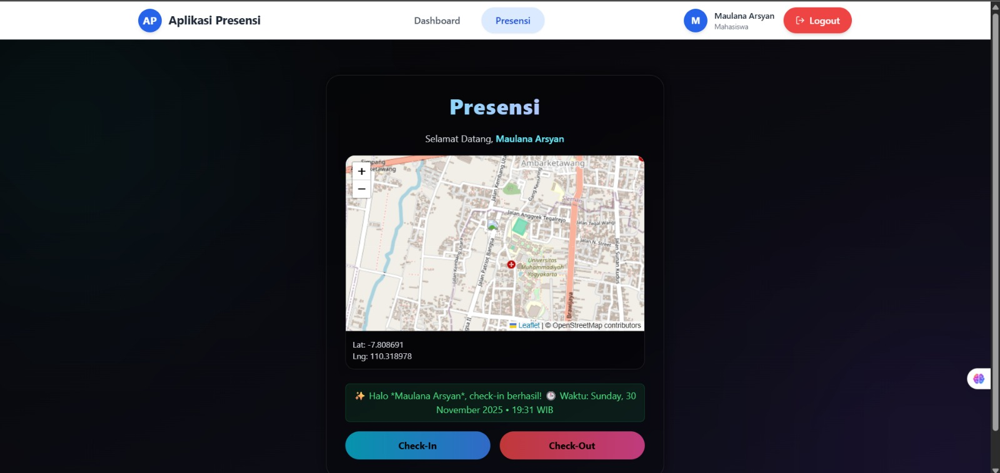
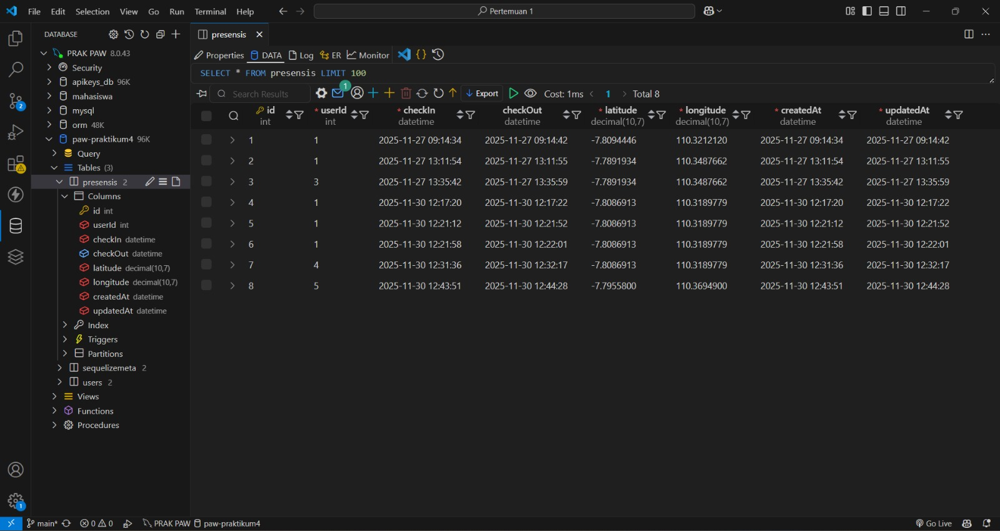

# 🧾 Tugas 9 – Fitur Presensi (Check-In, Check-Out, & Report)

**Nama:** Hikmatyar Alghifary  
**NIM:** 20230140193  
**Mata Kuliah:** Pengembangan Aplikasi Web  

---

# 🖼️ Dokumentasi Tampilan Aplikasi

| No | Nama Halaman | Screenshot |
|----|--------------|------------|
| 1 | Endpoint Check-In |  |
| 2 | Endpoint Check-Out |  |
| 3 | Tampilan Check-In |  |
| 4 | Tampilan Check-Out |  |
| 5 | Halaman Report Presensi |  |
| 6 | Database Presensi |  |

---
